[README.md](https://github.com/user-attachments/files/30623525/README.md)


<p align="center">
  <a href="https://www.linkedin.com/in/edmel-john-linaugo">
    </a>
  <a href="mailto:elinaugo137@gmail.com">
    </a>
  
</p>

---

## The Round Trip

> *A bit chaotic when coding.*

Most bugs live in the seams — where what the form field promised stops matching what the
query actually does. So I'd rather own the whole path than hand a feature over a boundary
and hope. That's the honest reason I work full stack.

TypeScript across the PERN stack — PostgreSQL, Express, React, Node.js — and React Native
when it needs to live in someone's pocket.

I ship **AI-powered features into production**: LLMs wired into workflows real people use,
not demos that impress once and fall over on the second prompt. Making them behave under
actual traffic turns out to be a different job from making them work, and it's the part
I've enjoyed most.

I also stay past the merge. Docker, ECR, EC2, Fargate, and the pipelines that carry it —
plus tests written on the assumption that a teammate will inherit them (Jest, Mocha, Cypress).

|  |  |
| --- | --- |
| **Full stack** | Form field to query plan, no handoffs |
| **AI in prod** | LLM features live, under real traffic |
| **Remote** | Iloilo → Quezon City → US-based team since 2024. Distance is a solved problem. |

---

## In Production

The repos are private — client work. The products aren't.

**`● LIVE`  Ryze Health** · [ryzehealth.com ↗](https://www.ryzehealth.com/)
*Health benefits for independent physicians*
Insurance quoting, a specialty-medication marketplace, and a physician provider network,
all funnelling through one member portal. Healthcare is a domain where an edge case is
someone's actual coverage, which changes how carefully you write things. I work across
the stack: lead capture into the CRM, the Physician Alliance rebrand, real-time
consultation features, and the move onto production infrastructure.
`TypeScript` `React` `Node.js` `Express` `PostgreSQL` `AWS` `Docker`

**`● LIVE`  Boston Heart Diagnostics** · [bostonheartdiagnostics.com ↗](https://bostonheartdiagnostics.com/)
*Cardiovascular diagnostics for providers and patients*
Testing that maps cardiovascular risk well past a standard lipid panel, delivered to
clinicians and patients through connected portals.
`TypeScript` `React` `Node.js` `PostgreSQL`

**`◆ DELIVERED`  Seahorse Inventory System** · *Seahorse Marketing, contract*
Inventory management built end to end for a retail client — offline-capable client, typed
API, tested data layer. Built it and tested it, which is a fast way to learn what your own
code does badly.
`Vite` `React` `TypeScript` `Express` `Prisma` `PostgreSQL` `RxDB` `Jest`

---

## The Stack

**Languages**


**Client**


**Server**


**Cloud & DevOps**


**Testing**


---

## Deploy Log

Taught networking on the side for most of it, which made me a better
explainer and a worse sleeper.

```
Oct 2024 — Present   Spectrum One · Associate Software Engineer
                     Full-time, remote. Full-stack product work end to end,
                     AI-powered features into production, and the AWS
                     infrastructure and container deployments behind them.

Aug 2024 — Dec 2025  Central Philippine University · Instructor
                     Part-time, hybrid. Taught Fundamentals of Programming
                     and Network Protocols — JavaScript, Node.js, Cisco
                     Packet Tracer, Wireshark.

Feb 2024 — May 2024  Kingsland Innovation Centre · QA Intern
                     Remote. Testing for ERTC Express — React, Feathers.js,
                     TypeScript, MongoDB, Sinon, Chai.

Dec 2022 — Jun 2023  Seahorse Marketing · Full Stack Developer / Tester
                     Contract, hybrid. Built and shipped the Seahorse
                     Inventory System.

2019 — 2024          Central Philippine University
                     BS Software Engineering
```

---

## Signals

<p align="center">
  
  
</p>


---

## Open a Connection

Open to full stack, backend, and AI-focused product roles — remote friendly.

If you're building something where the frontend and the database have to agree with each
other, that's the work I like most.

[**LinkedIn ↗**](https://www.linkedin.com/in/edmel-john-linaugo) · [**Email ↗**](mailto:elinaugo137@gmail.com)

<sub>Iloilo City, Philippines · coding is.an_art!</sub>
